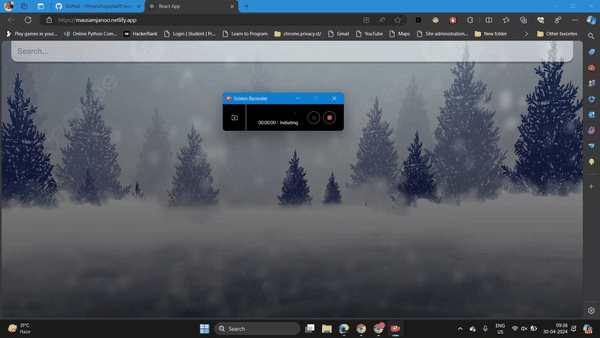

# Weather App using ReactJS



## Overview

This is a simple weather app built using ReactJS that allows users to check the weather conditions for a specific location. It utilizes a weather API to fetch real-time weather data and provides a clean and user-friendly interface.

## Features

- Display current weather conditions, temperature, and other relevant information.
- Search for weather information for a specific city or location.
- Clean and responsive design for a seamless user experience.

## Demo

[Live Demo](https://mausamjanoo.netlify.app)

## Installation

1. Clone the repository:

   ```bash
   git clone https://github.com/your-username/weatherBata-react.git
2. Navigate to project directory
  ```cd weatherBata
